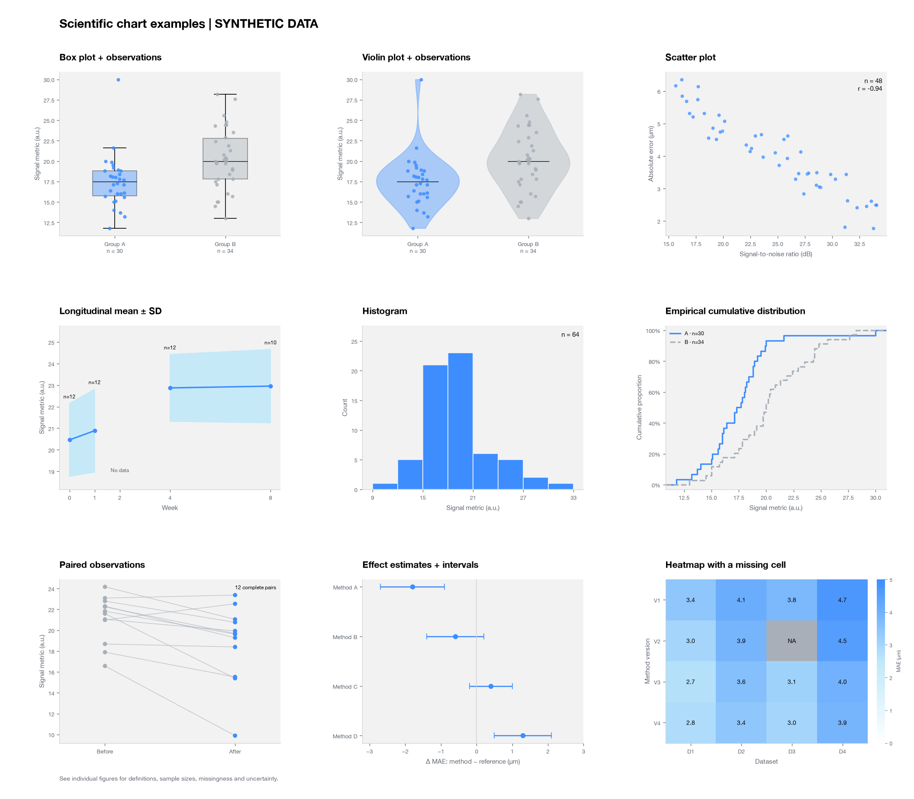

# Scientific chart examples

Read only the rows and sections relevant to the requested figure. These examples translate the visual system into common scientific encodings; they do not prescribe an analysis method, sample size, significance threshold, or clinical conclusion.



## Choose an encoding

| Question | Example | Essential data and caption information |
|---|---|---|
| How do groups differ in location and spread? | Box plot + observations | One value per defined observation unit; group n; quartile and whisker definitions |
| What does the distribution shape look like? | Violin + observations | Raw values, n, density bandwidth, width normalization and support |
| Are two measurements associated? | Scatter | Paired x/y values, units, one-point meaning and repeated-observation structure |
| How does a measure change over ordered time? | Line + band | Actual times, within/between-subject structure, n at each time and exact band definition |
| How many values fall in each range? | Histogram | Raw values, bin edges, count versus density and total n |
| What fraction is at or below a value? | Empirical CDF | Raw values, group-specific n, tied values and a proportion axis |
| How did the same units change? | Paired plot | Stable pair IDs, complete-pair count and incomplete-pair handling |
| What are the estimates and uncertainty? | Point/interval plot | Estimate, interval bounds/type, unit, common reference and interval provenance |
| How does a metric vary across two dimensions? | Heatmap | Numeric matrix, cell units, shared color scale, normalization and missing mask |

## Distribution examples: box, violin, histogram and ECDF

**Box plot.** Show the median and Q1–Q3, not a mean with confidence limits. This example uses linear-interpolated quantiles and whiskers at the most extreme observed values inside Q1 − 1.5 IQR and Q3 + 1.5 IQR. Values beyond the whiskers remain visible in the overlaid observations; suppressing duplicate automatic flier symbols must not remove those values. Use a thin median stroke (0.8 pt in this example) so it does not overpower the observations. The whiskers are not generally the minimum and maximum. [Matplotlib box-plot definition](https://matplotlib.org/stable/api/_as_gen/matplotlib.axes.Axes.boxplot.html)

**Violin.** A smooth density can suggest unsupported structure with very small samples, discrete data or a poor bandwidth. Prefer points, an ECDF or a box plot when density adds little. This example uses a Gaussian kernel, Scott bandwidth, equal maximum widths and an observed-range display; width does not encode group n. Use the same thin median stroke as the box plot, define its meaning, show n and observations, and do not let a smoothing curve imply measurements outside valid support. [Matplotlib violin parameters](https://matplotlib.org/stable/api/_as_gen/matplotlib.axes.Axes.violinplot.html)

**Histogram.** State bin boundaries or the binning rule and whether height is count, proportion or density. Density is normalized by bin width, so counts and density are not interchangeable. Use shared bin edges when comparing groups. The example pools the two groups, uses width 3 a.u. and a zero-based count axis; exact bin counts are exported.

**ECDF.** Use a right-continuous staircase with each group's own observation count as denominator; combine ties into their actual jump. Do not smooth the curve. The example includes explicit 0% and 100% endpoint plateaus. Quantiles and distribution differences can be read without choosing histogram bins or a kernel bandwidth.

## Association, time and pairing

**Scatter.** Define whether each point is a person, eye, image, sample mean or another unit; repeated measurements do not become independent subjects. Start with the observed points and readable axes. Add fits or intervals only when requested or analytically justified, and label their model and meaning. The example's Pearson r is descriptive, with no p-value, fitted trend or causal claim. For crowded data, use transparency or an appropriate density encoding rather than labeling every point.

**Line.** Position observations at their actual ordered times, including uneven spacing. State whether the band is SD, SE, a confidence interval or a prediction interval and how it was obtained. This example summarizes available repeated subjects with a mean and sample SD (`ddof=1`); n changes across visits. A missing visit is retained as null/NaN so both line and band break there. Do not delete missing times and accidentally join across a planned gap. If interpolation is intentional, identify it as interpolation. [Matplotlib missing-value behavior](https://matplotlib.org/stable/gallery/lines_bars_and_markers/masked_demo.html)

**Paired plot.** Join records by their actual subject/pair IDs, never by separately sorting the two measurements. Show all complete pairs and disclose missing follow-up: the example has 12 complete pairs among 13 enrolled synthetic subjects. Any paired difference uses those same complete pairs. These lines describe individual changes, not a significance test or a confidence interval.

## Estimates, intervals and matrices

**Point/interval plot.** Define the reference and the interval. The example has four methods’ mean absolute error differences (method minus one common reference), with supplied synthetic 95% confidence-interval fixtures. It does not estimate those intervals from observations or invent a sample size. Preserve both signed endpoints and the zero reference for differences. For ratios, a reference of 1 and a log axis may be more appropriate. Do not add a pooled-effect diamond or call the figure a meta-analysis without the corresponding analysis.

**Heatmap.** A continuous color scale is a quantitative encoding, not a decorative gradient. The example uses a common 0–5 μm sequential scale and numeric cell labels for mean absolute error; gray `NA` means missing, not zero. These cells are supplied synthetic aggregates without individual observations or cell n; do not imply that the averages can be recomputed from nonexistent source observations. Do not rescale rows or columns silently. If a signed matrix has a meaningful zero, use a centered diverging scale and explicitly define its colors instead of forcing a sequential scale. Use a borderless colorbar with restrained ticks and labels. Add subtle cell boundaries only when they aid reading; avoid a heavy black frame around the scale.

## When the requested chart lacks necessary data

- A group mean, SD and n do not determine its quartiles, whiskers or density. For a requested box/violin plot, obtain observations or appropriate explicitly supplied box summaries; do not synthesize hidden observations. Offer a correctly labeled mean/SD plot if the user prefers to use only those summaries.
- Two unpaired groups labeled “before” and “after” do not justify connecting individuals. Obtain pair IDs or use a group-comparison plot with the correct observation unit.

## Reproduce or adapt an example

When Matplotlib is appropriate, run the optional [gallery script](../scripts/scientific_chart_gallery.py) from the skill directory:

```sh
python3 scripts/scientific_chart_gallery.py --output-dir /path/to/gallery
# Optional: Chinese labels, with an installed CJK font
python3 scripts/scientific_chart_gallery.py --output-dir /path/to/gallery-zh --language zh
```

It writes nine SVG/PNG figures, `overview.png`, `gallery.md`, raw `data.json`, computed `statistics.json`, and a manifest with the seed and library versions. Nulls preserve missingness; no external data or services are used. Reproduction is scoped to the recorded environment. The script generates only clearly labeled synthetic fixtures; it is a readable translation example, not a general-purpose data ingestion or statistical inference tool.

Use the relevant drawing choices in task-specific code and apply the same specification in R, JavaScript or another available renderer. Do not run the whole gallery for an ordinary single-chart task. Keep raw/derived numerical data alongside the output so another reader can check every plotted result.
